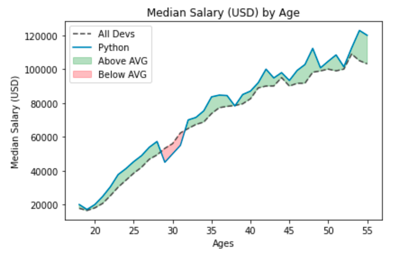

# Filling Area on Line Plots

- We will be execute how to fill between our line plots in Matplotlib using the data file.
- Not only can this make our graphs look more professional, but we can also add useful information by filling areas based on specific thresholds.
- This project will entail Filling Area on Line Plots in Matplotlib.

