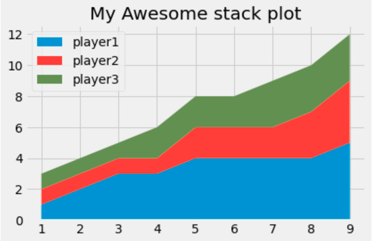

# Stack Plots

- We will create stack plots in Matplotlib.
- Sometimes these are called Area Charts. These are similar to pie charts, but instead of showing us the proportions at a single instant, these allow us to see the proportions over a series of points.
- This project will entail Stack Plots chart in Matplotlib.

